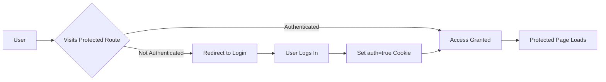

# 🛍️ GadgetTech - Modern E-Commerce Platform

A feature-rich, full-stack e-commerce web application built with Next.js 14, featuring user authentication, product management, shopping cart, and a stunning modern UI.

![GadgetTech Banner][https://via.placeholder.com/800x400/6366f1/ffffff?text=Home+Page](https://i.ibb.co.com/TBXbwgPN/Screenshot-35.png)

## 🌟 Features

### 🔐 Authentication & User Management
- ✅ Secure login/logout system with cookie-based sessions
- ✅ User registration functionality
- ✅ Protected routes with middleware
- ✅ Demo credentials for quick testing

### 🛒 E-Commerce Functionality
- ✅ Browse products with beautiful card layouts
- ✅ Add products to cart with quantity management
- ✅ Category-based product filtering
- ✅ Product search functionality
- ✅ Product ratings and reviews display
- ✅ Detailed product pages

### 📦 Product Management (Admin)
- ✅ Add new products with form validation
- ✅ Edit existing products
- ✅ Delete products
- ✅ Image URL support
- ✅ Dynamic category management

### 🎨 Modern UI/UX
- ✅ Responsive design (mobile-first approach)
- ✅ Beautiful gradient backgrounds
- ✅ Smooth animations and transitions
- ✅ Interactive hover effects
- ✅ Loading states and skeletons
- ✅ Toast notifications

### 📄 Additional Pages
- 🏠 Home/Landing page with hero section
- 📦 Product listing page
- ➕ Add/Edit item pages (protected)
- 🛒 Shopping cart page
- 📞 Contact page
- ℹ️ About page
- 🚚 Shipping information
- 💳 Returns & refunds policy
- 🛡️ Warranty information
- 🆘 Customer support

## 🚀 Tech Stack

- **Framework:** Next.js 14 (App Router)
- **Language:** JavaScript/React
- **Styling:** Tailwind CSS + Custom CSS
- **State Management:** React Context API (ItemsContext)
- **Authentication:** Cookie-based sessions
- **API:** RESTful API with Next.js Route Handlers
- **Deployment:** Vercel
- **Icons:** Lucide React / SVG Icons
- **Form Handling:** React Hooks

## 📋 Prerequisites

Before running this project, ensure you have:

- Node.js 18 or higher
- npm or yarn package manager
- Git for version control
- A modern web browser

## 🔧 Installation & Setup

### 1. Clone the repository

```bash
git clone https://github.com/yourusername/gadget-tech.git
cd gadget-tech
```

### 2. Install dependencies

```bash
npm install
# or
yarn install
```

### 3. Run the development server

```bash
npm run dev
# or
yarn dev
```

### 4. Open your browser

Navigate to [http://localhost:3000](http://localhost:3000)

The application will automatically reload when you make changes.

## 🎯 Usage Guide

### 🔑 Demo Login Credentials

```
Email: admin@gadgettech.com
Password: admin123
```

### 📦 Adding a New Product

1. **Login** using demo credentials
2. Navigate to **"Add Item"** page from the navbar
3. Fill in the product details:
   - **Product Title** (required) - Name of the product
   - **Price** (required) - Product price in USD
   - **Category** (required) - Select from existing or add custom
   - **Description** (required) - Detailed product description
   - **Rating** (optional) - Product rating (0-5)
   - **Image URL** (optional) - Product image link
4. Click **"Add Item"** to submit
5. Product will appear in the items list immediately

### 🛒 Shopping Experience

1. **Browse Products** - Visit the Items page
2. **Filter by Category** - Use the dropdown filter
3. **Add to Cart** - Click on product cards (coming soon)
4. **View Cart** - Access from navbar
5. **Checkout** - Complete your purchase

### 🔍 Product Search

- Use the search bar on the Items page
- Search by product name or description
- Results update in real-time

## 📁 Project Structure

```
gadget-tech/
├── src/
│   └── app/
│       ├── about/
│       │   └── page.jsx           # About us page
│       ├── add-item/
│       │   └── page.jsx           # Add product page (protected)
│       ├── api/
│       │   └── items/
│       │       ├── route.js       # GET & POST items API
│       │       └── [id]/
│       │           └── route.js   # PUT & DELETE specific item
│       ├── contact/
│       │   └── page.jsx           # Contact page
│       ├── items/
│       │   └── page.jsx           # Products listing page
│       ├── login/
│       │   └── page.jsx           # Login page
│       ├── returns/
│       │   └── page.jsx           # Returns policy page
│       ├── shipping/
│       │   └── page.jsx           # Shipping info page
│       ├── support/
│       │   └── page.jsx           # Customer support page
│       ├── warranty/
│       │   └── page.jsx           # Warranty information page
│       ├── components/
│       │   └── landing/
│       │       ├── CTA.jsx        # Call-to-action component
│       │       ├── FAQ.jsx        # FAQ section
│       │       ├── Features.jsx   # Features showcase
│       │       ├── Hero.jsx       # Hero section
│       │       ├── HowItWorks.jsx # How it works section
│       │       ├── PopularItems.jsx # Popular products
│       │       └── Testimonials.jsx # Customer testimonials
│       ├── context/
│       │   └── ItemsContext.js    # Global state management
│       ├── data/
│       │   └── items.json         # Product data storage
│       ├── Footer.jsx             # Footer component
│       ├── Navbar.jsx             # Navigation component
│       ├── favicon.ico            # Site favicon
│       ├── globals.css            # Global styles
│       ├── layout.jsx             # Root layout
│       └── page.jsx               # Home page
├── public/                        # Static assets
├── .gitignore                     # Git ignore rules
├── .vercel/                       # Vercel deployment config
├── eslint.config.mjs              # ESLint configuration
├── jsconfig.json                  # JavaScript config
├── middleware.js                  # Route protection middleware
├── next.config.mjs                # Next.js configuration
├── package-lock.json              # Lock file
├── package.json                   # Dependencies
├── postcss.config.mjs             # PostCSS config
├── tailwind.config.js             # Tailwind CSS config
└── README.md                      # Documentation
```

## 🔐 Authentication Flow



### Cookie Structure

```javascript
// Set on login
document.cookie = `auth=true; path=/; expires=${expiryDate.toUTCString()}`;

// Checked by middleware
const auth = request.cookies.get("auth")?.value;
```

## 🛣️ API Endpoints

### Products API

#### GET `/api/items`
Fetch all products

**Response:**
```json
{
  "success": true,
  "data": [
    {
      "id": 1,
      "title": "Premium Laptop",
      "price": 999.99,
      "category": "electronics",
      "description": "High-performance laptop",
      "image": "https://example.com/laptop.jpg",
      "rating": {
        "rate": 4.5,
        "count": 120
      }
    }
  ]
}
```

#### POST `/api/items`
Add a new product

**Request Body:**
```json
{
  "title": "New Product",
  "price": 149.99,
  "category": "electronics",
  "description": "Amazing product description",
  "image": "https://example.com/image.jpg",
  "rating": {
    "rate": 4.0,
    "count": 1
  }
}
```

**Response:**
```json
{
  "success": true,
  "message": "Item added successfully",
  "data": { /* new item */ }
}
```

#### PUT `/api/items/[id]`
Update an existing product

**Request Body:** Same as POST

**Response:**
```json
{
  "success": true,
  "message": "Item updated successfully"
}
```

#### DELETE `/api/items/[id]`
Delete a product

**Response:**
```json
{
  "success": true,
  "message": "Item deleted successfully"
}
```

## 🎨 Customization

### Changing Theme Colors

Edit `tailwind.config.js`:

```javascript
module.exports = {
  theme: {
    extend: {
      colors: {
        primary: '#6366f1',      // Indigo
        secondary: '#ec4899',     // Pink
        accent: '#8b5cf6',        // Purple
      },
      gradientColorStops: {
        'primary-start': '#6366f1',
        'primary-end': '#ec4899',
      }
    }
  }
}
```

### Adding New Categories

Update categories in `app/add-item/page.jsx`:

```javascript
const categories = [
  'electronics',
  'clothing',
  'books',
  'furniture',
  'sports',
  'your-new-category'
];
```

### Customizing Navigation

Edit `src/app/Navbar.jsx`:

```javascript
const navLinks = [
  { href: '/', label: 'Home' },
  { href: '/items', label: 'Shop' },
  { href: '/about', label: 'About' },
  { href: '/your-new-page', label: 'New Page' }
];
```

## 🚀 Deployment

### Deploy to Vercel (Recommended)

#### Method 1: GitHub Integration (Automatic)

1. Push your code to GitHub:
```bash
git add .
git commit -m "Initial commit"
git push origin main
```

2. Visit [vercel.com/new](https://vercel.com/new)
3. Import your GitHub repository
4. Configure project (usually auto-detected)
5. Click **"Deploy"**
6. Done! Your site is live 🎉

#### Method 2: Vercel CLI (Manual)

```bash
# Install Vercel CLI
npm install -g vercel

# Login to Vercel
vercel login

# Deploy to production
vercel --prod
```

### Build for Production

```bash
npm run build
# Creates optimized production build

npm start
# Runs production server locally
```

## 🐛 Troubleshooting

### Authentication Issues

**Problem:** Cannot access protected routes after login

**Solutions:**
1. Clear browser cookies:
   ```javascript
   // Browser console
   document.cookie.split(";").forEach(c => {
     document.cookie = c.replace(/^ +/, "").replace(/=.*/, "=;expires=" + new Date().toUTCString() + ";path=/");
   });
   ```
2. Hard refresh: `Ctrl + Shift + R` (Windows) or `Cmd + Shift + R` (Mac)
3. Try incognito/private mode
4. Check cookie in console: `console.log(document.cookie)`

### Build Errors

**Problem:** Build fails during deployment

**Solutions:**
```bash
# Clear Next.js cache
rm -rf .next

# Clear node modules and reinstall
rm -rf node_modules
npm install

# Rebuild
npm run build
```

### Middleware Not Triggering

**Problem:** Routes not being protected

**Solution:** Check `middleware.js` matcher:
```javascript
export const config = {
  matcher: [
    "/add-item/:path*",
    "/admin/:path*",
    "/login"
  ],
};
```

### API Errors

**Problem:** Items not loading

**Solutions:**
1. Check `data/items.json` exists and is valid JSON
2. Check API route in `app/api/items/route.js`
3. Check browser console for errors
4. Verify fetch URL is correct

### Styling Issues

**Problem:** Tailwind classes not working

**Solutions:**
1. Check `tailwind.config.js` content paths
2. Restart dev server: `npm run dev`
3. Clear browser cache
4. Verify class names are correct

## 📊 Performance Optimization

- ✅ **Image Optimization**: Use Next.js Image component
- ✅ **Code Splitting**: Automatic with Next.js
- ✅ **Lazy Loading**: Components load on demand
- ✅ **CSS Purging**: Tailwind removes unused styles
- ✅ **Caching**: API responses can be cached

## 🔒 Security Features

- ✅ Cookie-based authentication
- ✅ Protected routes with middleware
- ✅ Input validation on forms
- ✅ XSS protection (React default)
- ✅ CSRF protection with SameSite cookies

## 📱 Browser Support

- ✅ Chrome (latest)
- ✅ Firefox (latest)
- ✅ Safari (latest)
- ✅ Edge (latest)
- ✅ Mobile browsers (iOS Safari, Chrome Mobile)

## 🧪 Testing

```bash
# Run linter
npm run lint

# Check for build errors
npm run build
```

## 🤝 Contributing

Contributions are welcome! Please follow these steps:

1. Fork the repository
2. Create a feature branch:
   ```bash
   git checkout -b feature/amazing-feature
   ```
3. Commit your changes:
   ```bash
   git commit -m 'Add some amazing feature'
   ```
4. Push to the branch:
   ```bash
   git push origin feature/amazing-feature
   ```
5. Open a Pull Request

### Coding Standards

- Use meaningful variable names
- Follow React best practices
- Write clean, readable code
- Add comments for complex logic
- Test thoroughly before submitting

## 📝 License

This project is licensed under the MIT License - see the [LICENSE](LICENSE) file for details.

## 👨‍💻 Author & Contact

**GadgetTech Team**

- **GitHub:** [@yourusername](https://github.com/yourusername)
- **Email:** support@gadgettech.com
- **Website:** [gadgettech.vercel.app](https://gadgettech.vercel.app)

## 🙏 Acknowledgments

- [Next.js](https://nextjs.org/) - The React Framework
- [Tailwind CSS](https://tailwindcss.com/) - Utility-first CSS
- [Vercel](https://vercel.com/) - Deployment platform
- [React](https://react.dev/) - UI library
- [Lucide Icons](https://lucide.dev/) - Beautiful icons

## 📞 Support

Need help? We're here for you!

- 📧 Email: support@gadgettech.com
- 💬 GitHub Issues: [Report a bug](https://github.com/yourusername/gadget-tech/issues)
- 📖 Documentation: This README
- 💡 Feature Requests: [Request a feature](https://github.com/yourusername/gadget-tech/issues/new)

## 🗺️ Roadmap

### Upcoming Features
- [ ] User profile pages
- [ ] Order history
- [ ] Payment gateway integration
- [ ] Product reviews and ratings system
- [ ] Wishlist functionality
- [ ] Advanced search with filters
- [ ] Email notifications
- [ ] Admin dashboard
- [ ] Analytics integration
- [ ] Multi-language support

## 📸 Screenshots

### Home Page
![Home Page][https://via.placeholder.com/800x400/6366f1/ffffff?text=Home+Page](https://i.ibb.co.com/TBXbwgPN/Screenshot-35.png)

### Products Page
![Products][https://via.placeholder.com/800x400/ec4899/ffffff?text=Products+Page](https://i.ibb.co.com/mFVxNhzC/Screenshot-38.png)

### Add Item Page
![Add Item][https://via.placeholder.com/800x400/8b5cf6/ffffff?text=Add+Item+Page](https://i.ibb.co.com/Z1VRvPsp/Screenshot-39.png)

---

<div align="center">
  <p>Made with ❤️ by Amana Akter</p>
  <p>⭐ Star this repo if you find it helpful!</p>
  <p>🐛 Found a bug? <a href="https://github.com/yourusername/gadget-tech/issues">Report it</a></p>
  <p>💡 Have an idea? <a href="https://github.com/yourusername/gadget-tech/issues/new">Share it</a></p>
</div>

---

**Last Updated:** January 2025 | **Version:** 1.0.0
